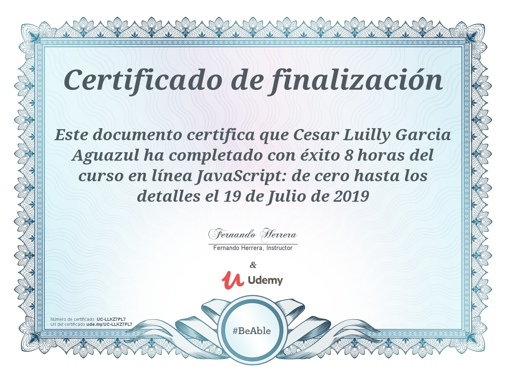

# Documentacion completa a traves de GitBook

https://cesar-luilly.gitbook.io/javascript-de-cero-hasta-los-detalles

# JavaScript: De cero hasta los detalles (ES5)node

**You can find files at the directory /src:**

* /src/Seccion1
* /src/Seccion2
* /src/Seccion3
* /src/Seccion4
* /src/Seccion5
* /src/Seccion6

**Development enviroment for Javascript:**

- Node Version 16.14.0
- Visual Studio Code

**Notebook eviroment:**

- Python 3.9.10
- Python kernel 3.9.10 64 bits
- Install extension Jupyter from Microsoft

**Create enviroment and deploy instructions:**

- python3 -m venv env
- .\env\Scripts\activate
- cd env/Scripts/
- Install all dependences
  - pip install node
  - pip install nodejs
  - pip install jupyter
  - pip install npm ipython ipython notebook
  - python.exe -m pip install ipykernel -U --force-reinstall
  - python.exe -m pip install --upgrade pip
  - npm install ijavascript
  - ijsinstall
  - pip freeze
  - jupyter notebook
- deactivate

**References to help**

- https://github.com/jupyter/jupyter/wiki/Jupyter-kernels
- https://www.youtube.com/watch?v=6j6L3feh1p4
- https://www.npmjs.com/package/ijavascript/v/4.1.0

Author: Cesar Luilly Garcia Aguazul
Co-Author: Fernando Herrera.
